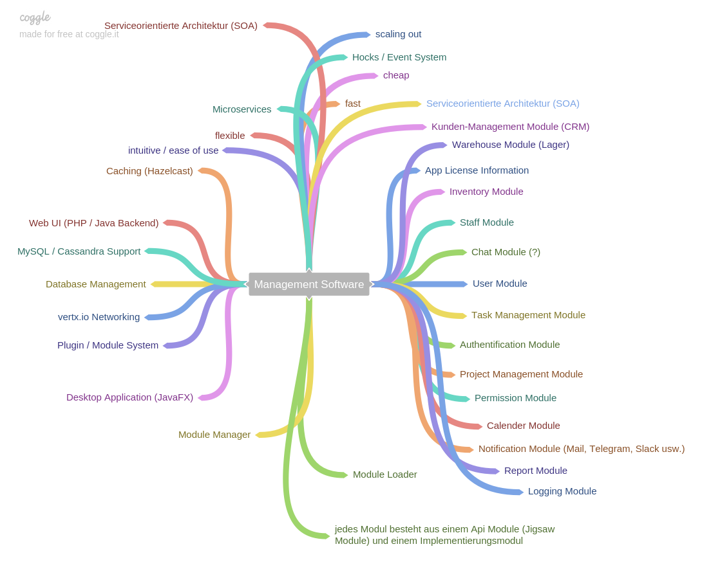

# ERP Backend

 

\
**Backend** of open source ERP (Enterprise-Resource-Planning) system, written in Java.\
\
**License**: Apache 2.0 License (Open Source)\
**Price**: free\
**Phase**: Concept / Planning Phase

## Goals of system

The **main goal** of this system is to provide an intuitive, easy to use ERP system for small and middle companies.\
Open Source (OS) ERP System should be free and very fast.\
Backend is Microservice-orientated and uses [vertx.io](http://vertx.io) for networking and distribution.\
It should be easy to **scale-out** (distributed system).\

Short Mindmap:

## System Requirements

  - Java 9 (JRE)
  - Database:
      * MySQL (free)
      * Cassandra Support is planned
  - Caching
      * [Hazelcast](http://hazelcast.org) (Open Source - free)
      
## Why use OS ERP system?

  - its free & open source!
  - you can customize it!
  - its very fast!
  - this erp system uses newest technologies
      * Java 9
      * Microservices architecture
      * service-orientated architecture (SOA)
  - this erp system can scale out and so balance with your needs of performance
  - active development
  
## Permission System

OS ERP System has an group-based permission system.\
So you can add permissions to groups and every user belongs to one or more groups.\
\
**System permissions**:\
System permissions are permissions which cannot be deleted.